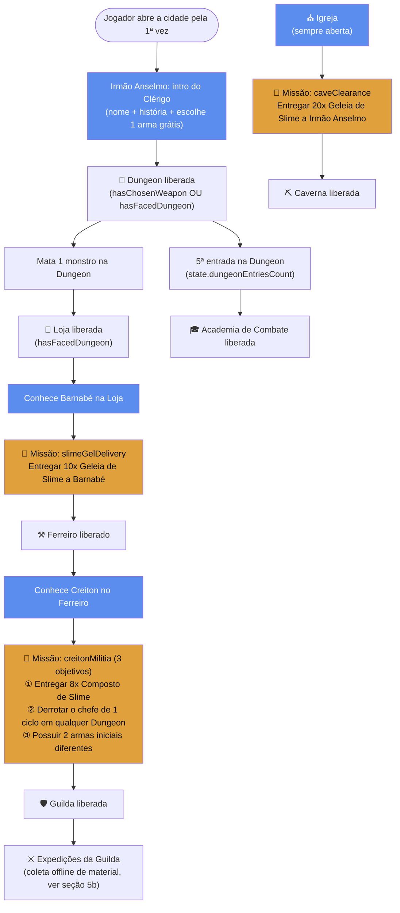
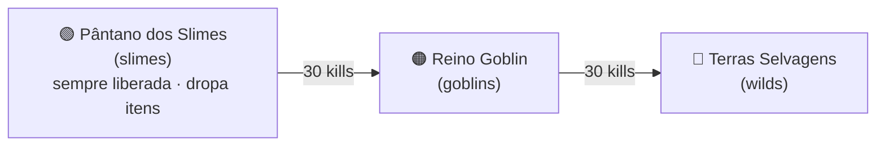
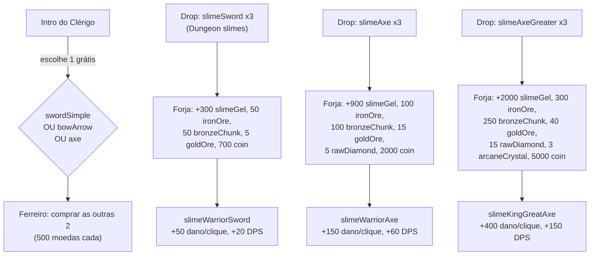
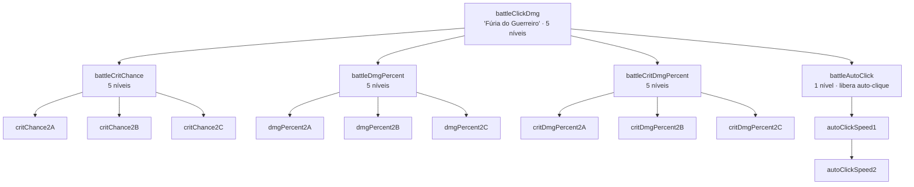
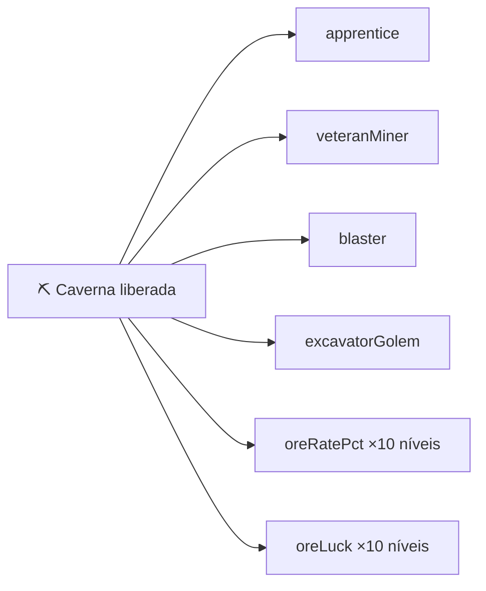
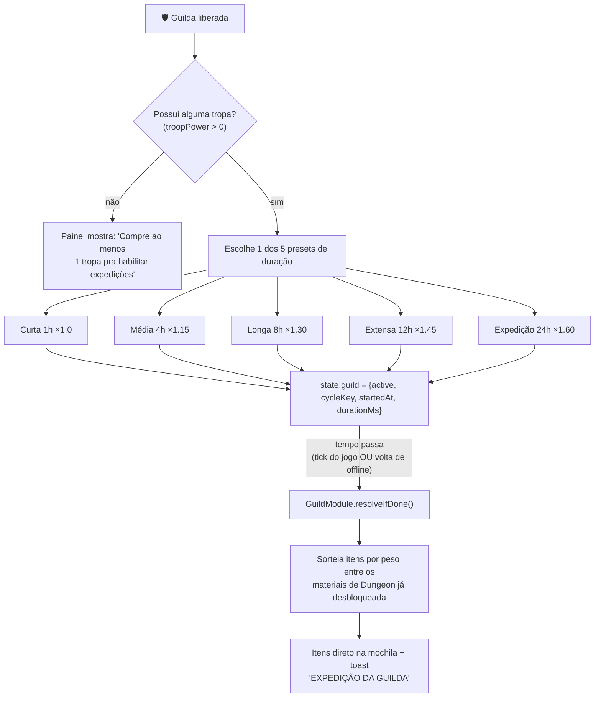
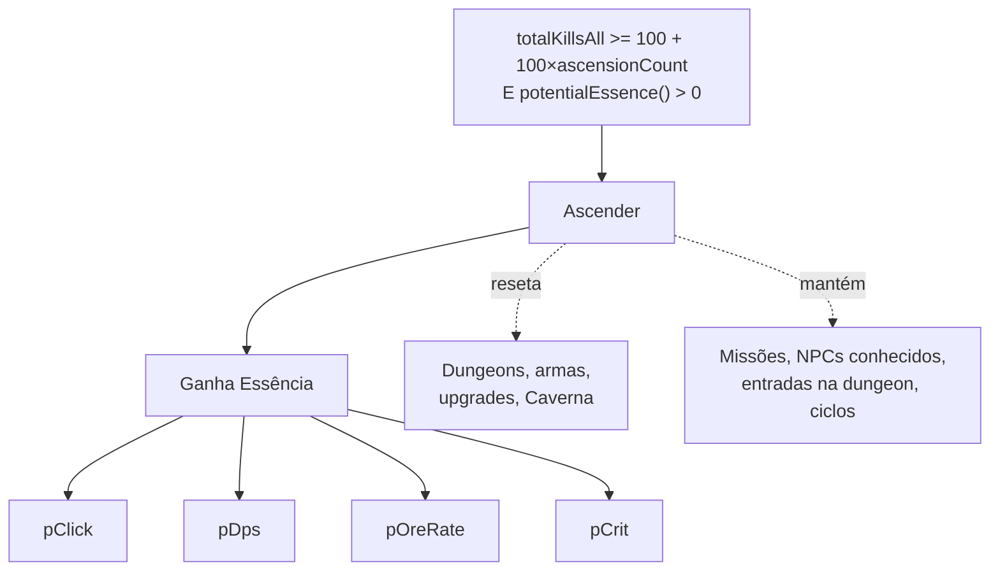

# Diagrama de Progressão — Beyond the Gate

> **Como manter este arquivo atualizado**
> Este diagrama é gerado a partir do código-fonte, não é uma spec paralela. Sempre que uma missão, desbloqueio, NPC ou sequência de história for **adicionada, removida ou alterada** em `js/config.js`, `js/onboarding.js`, `js/quests.js`, `js/dungeons.js`, `js/forge.js`, `js/progression.js`, `js/prestige.js`, `js/cavern.js` ou nos modais de `index.html`, **atualize as seções correspondentes abaixo na mesma alteração/commit**. Cada seção cita o arquivo:linha de origem — confira contra o código antes de confiar em uma seção antiga.
>
> Última sincronização com o código: **2026-07-17** (missão `creitonMilitia` com objetivos variados + Expedições da Guilda).

---

## 1. Visão geral — cidade, NPCs e missões

Fonte: `js/onboarding.js:38-47` (regras de desbloqueio), `js/config.js:433-452` (`QUEST_DEFS`), `js/quests.js:10-87` (motor de missão).

### Tabela de NPCs

| NPC | Local | Papel | Onde aparece | Dá / Exige |
|---|---|---|---|---|
| **Irmão Anselmo** | Igreja | Narrador do onboarding, dá a 1ª arma, dono da missão da Caverna | `js/onboarding.js` (`clericModal`, `shopUnlockModal`, `academiaUnlockModal`), `index.html:318-383` | Pede nome do jogador, conta a história, libera escolha de arma grátis. Depois exige **20x Geleia de Slime** (missão `caveClearance`) para reabrir a Caverna. |
| **Barnabé** | Loja | Comerciante, irmão do Creiton | `js/quests.js` (`openBarnabeIntro`), `index.html:387-403` | Exige **10x Geleia de Slime** (missão `slimeGelDelivery`) → libera o Ferreiro. |
| **Creiton** | Ferreiro | Ferreiro, irmão do Barnabé, vende armas e forja | `js/quests.js` (`openCreitonIntro`), `js/forge.js`, `index.html:130-160, 407-419` | Vende armas iniciais avulsas (500 moedas) e forja armas quebradas. Exige **8x Composto de Slime** (missão `creitonMilitia`) → libera a Guilda. |

> Observação: `ANSELMO_LINES` existe em `config.js:335-339` mas não está conectado a nenhuma renderização de falas — é conteúdo órfão/planejado, ao contrário de `BARNABE_LINES`/`CREITON_LINES` que já são usados.

### Tabela de missões (`QUEST_DEFS`, `js/config.js`)

Cada missão tem um array `objectives` (motor genérico em `QuestModule.objectiveDone`/`canComplete`, `js/quests.js`) — só pode ser concluída quando **todos** os objetivos estiverem feitos. Tipos de objetivo suportados hoje: `deliverItem` (entrega item, consumido ao concluir), `defeatCycle` (checa `state.totalCyclesCompleted`, vitalício mesmo entre Ascensões) e `ownWeapons` (checa quantas `WEAPON_DEFS` distintas o jogador já possui).

| # | Chave | NPC | Objetivos | Recompensa | Persistência |
|---|---|---|---|---|---|
| 1 | `slimeGelDelivery` | Barnabé | Entregar 10x `slimeGel` | Libera **Ferreiro** | `state.quests.slimeGelDelivery` |
| 2 | `creitonMilitia` | Creiton | ① Entregar 8x `slimeCompound` · ② Derrotar o chefe de 1 ciclo em qualquer Dungeon · ③ Possuir 2 armas iniciais diferentes | Libera **Guilda** | `state.quests.creitonMilitia` |
| 3 | `caveClearance` | Irmão Anselmo | Entregar 20x `slimeGel` | Libera **Caverna** | `state.quests.caveClearance` |

Essas 3 são as únicas missões implementadas hoje. Todos os outros desbloqueios da cidade (Dungeon, Loja, Academia) são **computados ao vivo** a partir do progresso, não guardados como flag de missão (comentário explícito em `js/onboarding.js:12-14`: entrega de item é irreversível, então precisa de flag; o resto dá pra recalcular).

---

## 2. Dungeons

Fonte: `MAPS` em `js/config.js:167-228`, lógica em `js/dungeons.js:7-11`. Cada dungeon tem 10 posições por ciclo (posição 10 = chefe; posições 5 e 9 podem ter spawn duplo). Só `slimes` dropa itens hoje — expandir loot pras outras é item pendente do `TODO.md:78`.

---

## 3. Armas e forja (Ferreiro)

Fonte: `WEAPON_DEFS`/`FORGED_WEAPON_DEFS` em `js/config.js:362-423`, execução em `js/forge.js`. Só uma arma equipada por vez (`state.equippedWeapon`); minérios só vêm da Caverna (seção 5).

---

## 4. Academia de Combate — árvore de upgrades

Fonte: `UPGRADE_DEFS`/`UPGRADE_TREE` em `js/config.js:478-599`; regra de desbloqueio (`requires` precisa atingir `maxLevel` do próprio pai) em `js/progression.js:16-21`.

---

## 5. Caverna (mineração)

Liberada pela missão `caveClearance` (seção 1). Sem pré-requisitos internos — compra livre, custo exponencial:

Fonte: `PROSPECTOR_DEFS`/`CAVERN_UPGRADE_DEFS` em `js/config.js:292-311`, `js/cavern.js`.

---

## 5b. Expedições da Guilda (coleta offline)

Liberada junto com a Guilda (missão `creitonMilitia`, seção 1). Manda as **tropas já compradas** (`TROOP_DEFS`/`state.troops`) coletarem material de Dungeon sozinhas por uma duração fixa escolhida pelo jogador — resolve sozinha, online ou offline, sem etapa de "baú" (item cai direto na mochila assim que o ciclo termina).

- **Rendimento**: `itemsTotal = round(CONFIG.guildItemsPerHourPerPower × troopPower × horas × rateMult)`, onde `troopPower` é a soma de `dps × quantidade` só das `TROOP_DEFS` (sem bônus de arma/prestígio — é poder de tropa "cru", não dano de combate). Presets mais longos têm `rateMult` maior de propósito, pra recompensar esperar mais.
- **Sorteio de item**: só materiais (`ITEM_DEFS.type==='material'`) de Dungeon já desbloqueada (`DungeonModule.isUnlocked`), ponderado pelo campo `weight` de cada item (mesmo padrão de `MINERAL_DEFS`/`CavernModule.rollMineral`).
- **Resolução**: chamada tanto no tick do jogo (`js/main.js`, enquanto o jogo está aberto) quanto ao carregar um save (`js/mainmenu.js`, `finishEnteringLoadedGame`) — cobre expedição concluída com o jogo fechado.

Fonte: `GUILD_EXPEDITION_DEFS`/`CONFIG.guildItemsPerHourPerPower` em `js/config.js`, `dungeon`/`weight` em `ITEM_DEFS` (`js/config.js`), lógica em `js/guild.js` (`GuildModule`), UI em `UI.renderGuildExpedition` (`js/ui.js`).

---

## 6. Prestígio / Ascensão

Fonte: `PRESTIGE_UPGRADE_DEFS` em `js/config.js:601-606`, lógica em `js/prestige.js` (reset/keep em `js/prestige.js:33-42`).

---

## 7. Planejado / não implementado (roadmap, `TODO.md`)

- Novas missões além das 3 atuais (`TODO.md:37`).
- Novas Dungeons (Necrópole, Floresta Élfica, Abismo Demoníaco) — mencionado no `TODO.md:71-73`, mas a seção correspondente não existe mais no `README.md` atual.
- Sistema de conquistas — só o modal existe (`js/ui.js:337-350`), sem lista nem tracking.
- Sprite jogável (hoje só monstros têm sprite).
- Equipamentos além de armas (armadura, acessórios).
- Auto-upgrade/auto-buy, 2ª camada de prestígio ("Transcendência"), áudio.

> ⚠️ O `TODO.md` ainda lista "Missão de desbloqueio da Caverna" e "Liberar Guilda por missão" como pendentes (linhas 39-45), mas ambas já estão implementadas no código (`caveClearance`, `creitonMilitia`). Trate este diagrama — sincronizado direto com `js/config.js` — como fonte de verdade sobre o que já existe; o `TODO.md` está desatualizado nesse ponto.
